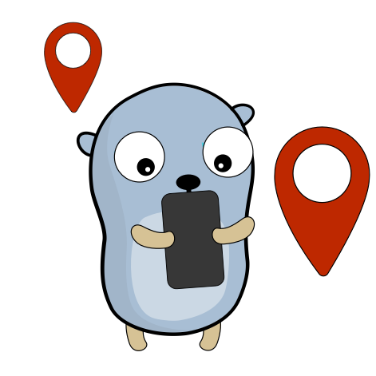
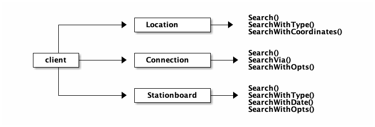

# OpenTransport Client
 
 <p>
     
 </p>
 

[](https://codecov.io/gh/minderjan/opentransport-client)
[](https://sonarcloud.io/dashboard?id=minderjan_opentransport-client)

The OpenTransport Client offers a simplified integration of the Swiss Public Transport API into a Golang project. 
The corresponding documentation of the API can be found here: https://transport.opendata.ch/docs.html

__Restrictions__

* The number of queries against the API are [limited](https://timetable.search.ch/api/help). 
* Issues of the API are tracked [here](https://github.com/OpendataCH/Transport/issues).

__Content__

* [Usage](#usage)
* [Example](#example)
* [Documentation](#documentation)
* [Showcase](#showcase)
* [Development](#development)
* [Contribution](#contribution)
* [Changelog](#changelog)
* [License](#license)
* [Author](#author)

## Install
You need a working golang 1.14+ environment on your machine. If this is not the case, use this guide to [getting started](https://golang.org/doc/install).

```bash
go get -v github.com/minderjan/opentransport-client/opentransport
```

## Usage

The library is separated into different services. These are accessible via an instance of the OpenTransport Client.



## Example
```go
package main

import  (
	"fmt"
	"context"
	"github.com/minderjan/opentransport-client/opentransport"
	"time"
)

func main() { 
	// Create a new Client 
	client := opentransport.NewClient()

	// Query a location
	locations, _ := client.Location.Search(context.Background(), "Zürich HB")
	for _, s := range locations {
		fmt.Printf("%s\n", s.Name)
	}

	// Query a connection
	connResult, _ := client.Connection.Search(context.Background(), "Zürich HB", "Bern", time.Now())
	for _, c := range connResult.Connections {
		s := c.Sections[0] // first part of the connection
		fmt.Printf("%s %s at %s on platform %s\n", s.Journey.Category, s.Journey.Number, s.Departure.Departure.Time.Format("15:04"), s.Departure.Platform)
	}

	// Query a stationboard
	stbResult, _ := client.Stationboard.Search(context.Background(), "Zürich HB")
	for _, j := range stbResult.Journeys {
		fmt.Printf("Departure at %s (%s)%s to %s\n", j.Stop.Departure.Time.Format("15:04"), j.Category, j.Number, j.To)
	}
}
```
There are more working examples available in `example` directory. Use these to get inspired.
```
go run example/name-of-example/main.go
```

## Documentation
A detailed documentation of the package is available on [Godoc](https://pkg.go.dev/github.com/minderjan/opentransport-client)

## Showcase
There is one showcase available which demonstrates the functionality of the package with a real world use case.
* [Terminal Stationboard UI](https://github.com/minderjan/terminal-stationboard-ui)

## Development

1. Setup a local [Golang Environment](https://golang.org/doc/install). Use Go 1.14+
2. Clone the repository somewhere on your machine or put it in your [GOPATH](https://golang.org/doc/gopath_code.html)
3. Start a mocked API or use the prod API to test your requests (see in `dev` directory)

### Dev client
Run client with a preconfigured remote url at http://localhost:3001/v1/.
```
go run dev/client.go
```

### Run Tests
Tests can be executed within the root directory of this repository.
```
go test -v -covermode=count -coverprofile=bin/coverage.out ./opentransport
```

Integration tests are not part of the pipeline (because of the api rate limit). 
You can run these tests by providing an `integration` build tag.
```
go test -v -tags=integration ./opentransport
```

Visualize the Code Coverage as Website
```
go tool cover -html=bin/coverage.out
```

### Logging
The library does not produce log messages by default. However, this can be adjusted. 
You can either enable logging with an empty io.Writer to write to os.stdout.

```go
// Write to stdout and stderr
client.EnableLogs(nil)
```
You can also define your own output, for example to write the logs to a file.
```go
// Create a logfile
f, _ := os.OpenFile("opentransport.log", os.O_RDWR|os.O_CREATE|os.O_APPEND, 0666)

// Create new multi writer
multi := io.MultiWriter(f, os.Stdout)

// Write to stdout and the logfile
client.EnableLogs(multi)
```

## Contribution

You're welcome to contribute to this repository. Please be aware of our [Code of Conduct](.github/CODE_OF_CONDUCT.md) and [Contribution Guidelines](.github/CONTRIBUTING.md).

## Changelog

* _v0.1.0_ Initial Version

## License
This software is licensed under a MIT license

## Author
This library was created as part of a diploma thesis at the Juventus School in Zurich by [Jan Minder](https://github.com/minderjan)